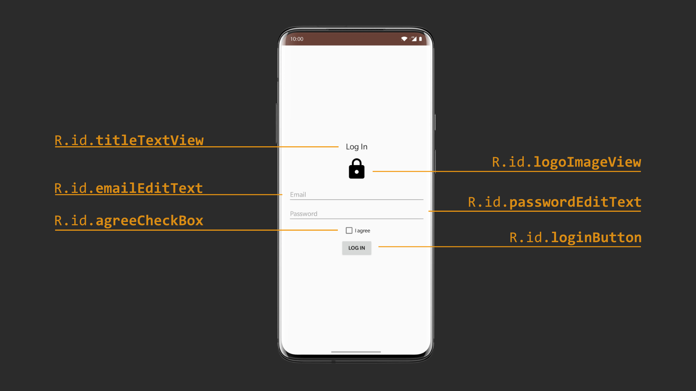
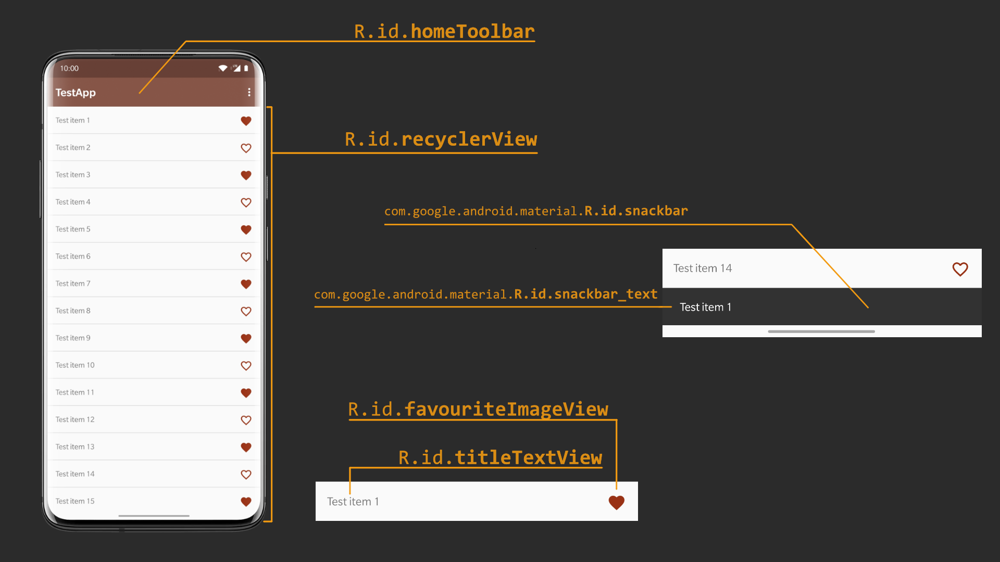
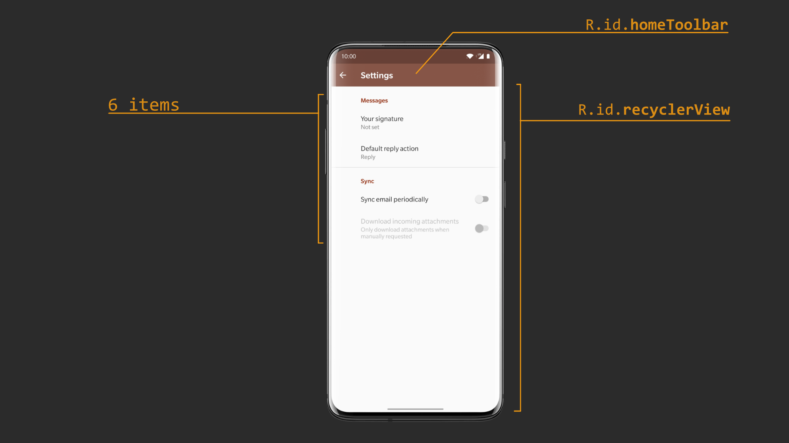

# Introduction to Android UI Testing

The application was created for improving skills (from the very beginning) in testing Android application use Espresso framework. Each screen contains UI elements which are used by many applications. 

  
  
  

This is the first application from the workshop "Creating Robust UI tests in Android" which allows everyone to learn the basics of Espresso:
* How to test separate screen in Android application
* How to interact with Android Views
* How to verify Settings screen in Android application
* How to create custom matchers and work efficiently with Espresso framework
* How to create custom actions which allow interacting with child view

# Structure of the project
The project has two main branches
* master
* solutions

The **master** branch has failed test cases which should be created from scratch. 
Each test case has a comment with a description of the test case and a hint (what can be used for implementing it).

The **solutions** branch has solutions for all test cases.

***Note:** In case if any of description is not understandable, please create an issue.*  

# App screens with views
## Login screen

  

## Home screen

  

## Settings screen

  

